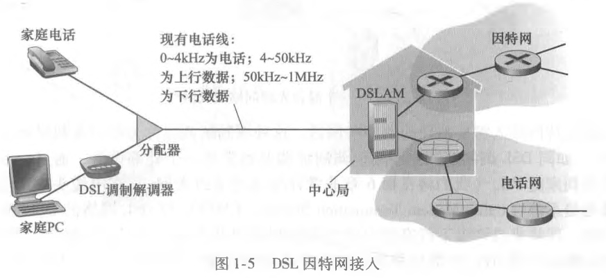
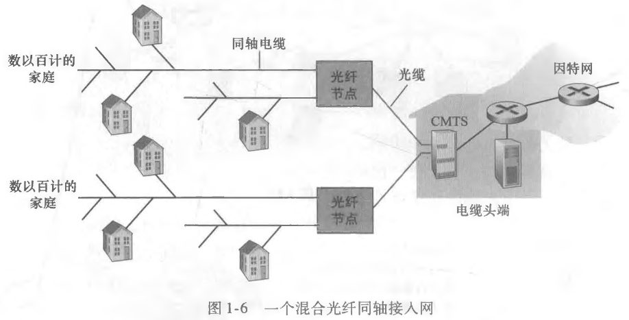
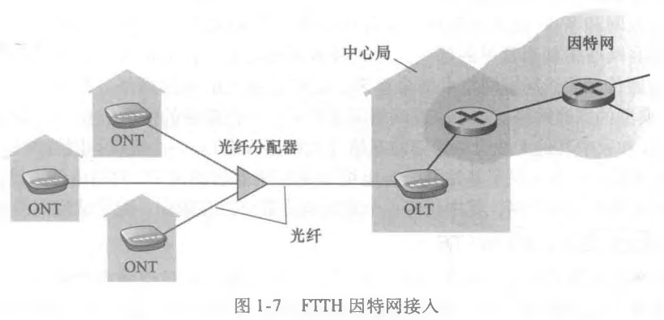

# 1 - 计算机网络和因特网

## 1.1 什么是因特网

&emsp;&emsp;本书中使用一种特定的计算机网络，即*公共因特网*，作为讨论计算机以其协议的主要载体。可以从具体结构和服务描述来描述互联网。

### 1.1.1 具体构成描述

&emsp;&emsp;用因特网的术语来说，所有连接因特网的设备都成为*主机（host）*或*端系统（end system）*。

&emsp;&emsp;**端系统**通过*通信链路（communication link）*和*分组交换机（packet switch）*连接在一起。不同的链路能够以不同的速率传输数据，**链路**的*传输速率（transmission rate）*用比特每秒来度量。当一台端系统要向另一台端系统发送数据时，发送端将数据分段，并为每段加上首部字节，这样形成信息包用计算机网络的术语成为*分组（packet）*。

&emsp;&emsp;**分组交换机**从它的一条入通信链路接受到达的**分组**，并从其他一条出通信链路转发该分组。当今的互联网中，两种最显著的类型是*路由器（router）*和*链路层交换机（link-layer switch）*。这两种交换机朝着最终目的地转发分组。从发送端系统到接收端系统，一个分组所经历的一系列通信链路和分组交换机称为通过该网络的*路径（path）*。

&emsp;&emsp;**端系统**通过*因特网服务提供商（Internet Service Provider， ISP）*接入因特网。每个ISP自身就是一个由多台分组交换机和多段通信链路组成的网络。较低层的ISP通过国家的、国际的较高层ISP互联起来。较高层ISP是由通过高速光纤链路互联的告诉路由器组成的。无论是高层的还是底层ISP网络，它们每个都是独立管理的，运行着IP协议，遵从一定的命名和地址规则。

&emsp;&emsp;**端系统、分组交换机和其他因特网部件**都要运行一系列*协议（protocol）*，这些协议控制因特网中信息的接受和发送。*TCP（Transmission Control Protocol，传输控制协议）*和 IP（Internet Protocol，网络协议）是因特网中两个最为重要的协议。IP协议定义了在路由器和端系统之间发送给和接受的分组格式。

### 1.1.2 服务描述

&emsp;&emsp;以下从*应用程序提供服务的基础设施的角度来描述因特网*。应用程序涉及多个相互交换数据的端系统，故它们被称为*分布式应用程序（distribute application）*。

&emsp;&emsp;与互联网相连的端系统提供了一个*套接字接口（socket interface）*,该接口规定了运行在一个端系统上的程序请求因特网基础设施向运行在零一个端系统的特定目的地程序交付数据的方式。

### 1.1.3 什么是协议

&emsp;&emsp;*协议*定义了在两个或多个通信实体之间交换的报文的格式和顺序，以及报文发送和接受一条报文或其他事件采取的动作。

## 1.2 边缘网络

&emsp;&emsp;*网络边缘*即日常使用的计算机、智能手机和其他设备。也被称为*端系统、主机*，因为它们容纳（即运行）应用程序。主机又进一步划分为两类：*客户端（client）*和*服务器（server）*。如今大部分服务器都属于大型*数据中心（data center）*。

### 1.2.1 接入网

&emsp;&emsp;接入网指将端系统物理连接到其**边缘路由器（edge router）**的网络。边缘路由器是端系统到任何其他远程端系统的路径上的第一台路由器。

#### 1. 家庭接入：DSL、电缆、FTTH、拨号和卫星

&emsp;&emsp;宽带住宅接入最流行的类型：**数字用户线（Digital Subscriber Line，DSL）**和**电缆**。住户通常从提供本地电话接入的本地电话公司处获得DSL因特网接入，使用DSL时，本地电话公司也是它的ISP。每个用户的DSL调制解调器使用现有的电话线与位于电话公司的本地中心局（CO）中的**数字用户线接入复用器（DSLAM）**交换数据。家庭的DSL调制解调器得到数字数据后将其转换为高频音，通过电话线传输给本地中心局的DSLAM处转换回数字形式。

&emsp;&emsp;家庭电话线同时承载了数据和传统电话信号，它们用不同频率进行编码。

* 高速下行信道，$50kHz$ 到 $1MHz$。
* 中速上行信道，$4kHz$ 到 $50kHz$。
* 普通的双向电话信道，$0$ 到 $4kHz$。

&emsp;&emsp;这样看的DSL线路像是3根单独的线路一样。用户一侧，一个分配器把到达家庭的数据信号和电话信号分隔开，并将数据信号转发给DSL调制解调器。电话公司一侧，DSLAM把数据和电话信号分隔开，并将数据送往因特网。

&emsp;&emsp; DSL利用电话公司现有的本地电话基础设施，而**电缆因特网（cable Internet access）**利用了有线电视公司现有的有线电话基础设施。由于这个系统中应用了光纤和同轴电缆，所以被称为**混合光纤同轴（Hybrid Fiber Coax, HFC）**系统。

&emsp;&emsp;电缆因特网接入需要特殊的调制解调器，称为**电缆调制解调器（cable modem）**。通常是一个外部设备，通过一个以太网端口接入家庭PC。在电缆头端，电缆调制解调器端接系统（CMTS）与DSL网络的DSLAM具有相似的功能，即将发来的模拟信号转换回数字形式。

&emsp;&emsp;另一种提供更高速的技术是**光纤到户（Fiber To The Home, FTTH）**。即从本地中心局直接到家庭提供一条光纤路径。

&emsp;&emsp;从中心局出来的每根光纤实际上由许多家庭共享，到了相对接近这些家庭的位置，该光纤分成每户一根光纤。这种分配由两种竞争性的光纤分布体系结构：*主动光纤网络（Active Optical Network，AON）*和*被动光纤网络（Passive Optical Network, PON）*。AON本质是交换因特网。

&emsp;&emsp;PON技术用于Verizon的FIOS服务中。下图使用PON分布体系的FTTH。

&emsp;&emsp;每个家庭具有一个*光纤网络端接器（Optical Network Terminator，ONT）*，它由专门的光纤连接到邻近的*分配器（splitter）*。该分配器把一些家庭集结到一根共享的光纤，该光纤再连接到本地电话和公司的中心局的*光纤线路端接器（Optical Line Terminator，OLT）*。该OLT提供了光信号和电信号之间的转换，经过本地电话公司路由器与因特网相连。用户将一台家庭路由器与ONT相连，并经过这台家庭路由器接入因特网。在PON体系结构中，所有从OLT发送到分配器的分组在分配器处复制。

&emsp;&emsp;在无法提供DSL、电缆和FTTH的地方，还可采用另两种接入网技术为家庭提供因特网接入。能够使用卫星链路将住宅以超多1Mbps的速率与因特网相连。

#### 2. 企业（和家庭）接入：以太网和WiFi

&emsp;&emsp;在公司或校园，越来越多使用*局域网（LAN）*将端系统连接到边缘路由器。以太网是最为流行的接入技术。以太网使用双绞铜线与一台以太网交换机相连。

&emsp;&emsp;在无线LAN将端系统连接到边缘路由器。在无线LAN环境中，无线用户从/到一个接入点发送/接收分组，该接入点与企业网连接，企业网再与有线因特网相连。基于`IEEE 802.11`技术的无线LAN接入，俗称`WiFi`。

#### 3. 广域无线接入：3G和LTE

&emsp;&emsp;移动设备应用了与蜂窝移动电话相同的无线基础设施，通过蜂窝网提供商运营的基站来发送和接受分组。

### 1.2.2 物理媒体

&emsp;&emsp;物理媒体分成两种类型：*导引型媒体（guided media）*和*非导引型媒体（unguided media）*。对于前者，电波沿着固体媒体前行，如光缆、双绞铜线或同轴电缆。对于后者，电波在空气或外层空间中传播，如无线局域网或数字卫星频道。

## 1.3 网络核心

